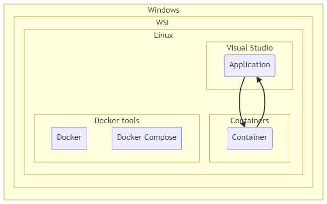
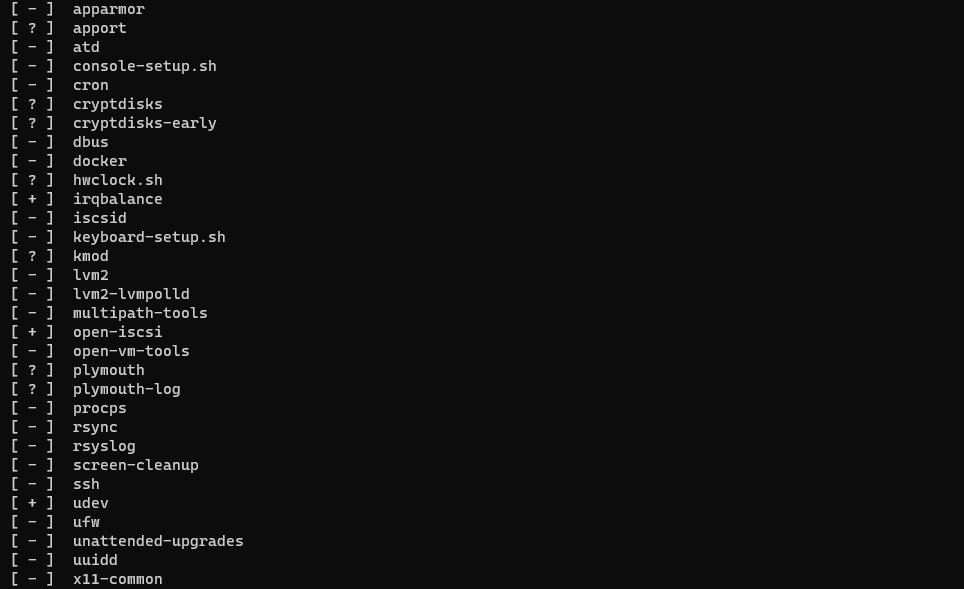
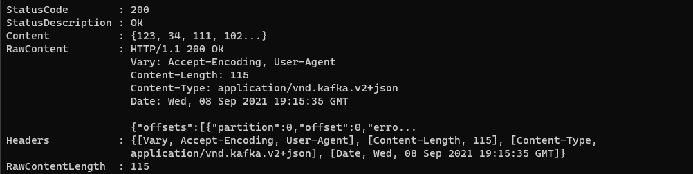
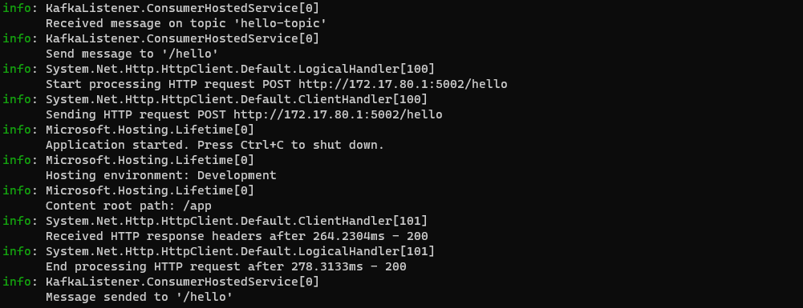
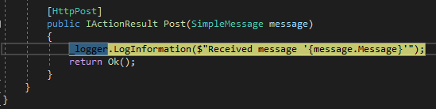

# Docker Engine on WSL + Visual Studio 2019 without Docker Desktop

## Preface

This post present a solution to stop using Docker Desktop and use only Docker Engine on WSL.

I decide to use :
- WSL2
- Ubuntu 20.04
- Docker for Linux
- Docker Compose for Linux
- Visual Studio 2019

I want to do something like this :



## Prerequisite

- Install WSL version 2 (see [Microsoft documentation](https://docs.microsoft.com/en-us/windows/wsl/install-win10))
- Install Linux (personally I choose [Ubuntu](https://www.microsoft.com/fr-ca/p/ubuntu-2004-lts/9n6svws3rx71))
- Install [Visual Studio 2019](https://visualstudio.microsoft.com/fr/vs/)
- Clone this repository

## Configure WSL

You maybe need to configure WSL to limit processor and memory usage.

This can be done with the file `.wslconfig` in your Windows profile folder (%USERPROFILE%).

```
[wsl2]
memory=4GB   # Limits VM memory in WSL 2 up to 4GB
processors=2 # Makes the WSL 2 VM use two virtual processors
```

See [Microsoft documentation](https://docs.microsoft.com/en-us/windows/wsl/wsl-config#configure-global-options-with-wslconfig).

## Install Docker tools

### Install Docker

From [Docker documentation](https://docs.docker.com/engine/install/ubuntu/) :

``` console
sudo apt-get update
```
``` console
sudo apt-get install apt-transport-https ca-certificates curl gnupg lsb-release
```
``` console
curl -fsSL https://download.docker.com/linux/ubuntu/gpg | sudo gpg --dearmor -o /usr/share/keyrings/docker-archive-keyring.gpg
```
``` console
echo \
  "deb [arch=amd64 signed-by=/usr/share/keyrings/docker-archive-keyring.gpg] https://download.docker.com/linux/ubuntu \
  $(lsb_release -cs) stable" | sudo tee /etc/apt/sources.list.d/docker.list > /dev/null
```
``` console
sudo apt-get update
```
``` console
sudo apt-get install docker-ce docker-ce-cli containerd.io
```
``` console
sudo docker run hello-world
```

You will have an error here :


Docker service didn't start automatically in WSL, even if you reboot Ubuntu, since `systemd` is not enabled.

``` console
service --status-all
```



You can start it manually :

``` console
sudo service docker start
```

Allow Docker without `sudo` (see [Docker post installation documentation](https://docs.docker.com/engine/install/linux-postinstall/))

``` console
sudo groupadd docker
```
``` console
sudo usermod -aG docker $USER
```
``` console
newgrp docker 
```
``` console
docker run hello-world
```

### Install Docker Compose

``` console
sudo apt update
```
``` console
sudo apt install docker-compose
```

## Start multi-container with Docker Compose

This [docker-compose.yml](./src/docker-compose.yml) is configured to start a Kafka environment and the listener application. If you open it, you will see the listener configuration :

``` yaml
services:
  listener:
    container_name: listener
    image: ${DOCKER_REGISTRY-}listener
    depends_on:
      - rest-proxy
    build:
      context: .
      dockerfile: KafkaListener/Dockerfile
    ports:
      - "80"
    environment:
      ASPNETCORE_ENVIRONMENT: Development
      ASPNETCORE_URLS: http://+:80
      ConsumerConfig__BootstrapServers: kafka:9092
      ConsumerConfig__GroupId: wsl-consumer
      ListenerConfig__Host: http://172.17.0.1:5002
      ListenerConfig__Route: /hello
      ListenerConfig__Topic: hello-topic
```

_The address **172.17.0.1** is the address of Docker_.

So let's start the environment :

``` console
docker-compose up -d --build && docker attach listener
```

Now let's start the application to rename :

``` console
dotnet run --project ./WslApplication/WslApplication.csproj  --urls "http://172.17.0.1:5002"
```

Ok, now we send a message to Kafka :

_To communicate with the container from Windows, you must use this address **[::1]**_.

``` powershell
Invoke-WebRequest -Uri 'http://[::1]:8082/topics/hello-topic' -Method POST -ContentType 'application/vnd.kafka.json.v2+json' -Body '{"records":[{"value":{"Message": "Hello Kafka!"}}]}' -UseBasicParsing
```



You should see this message in both applications :




## Visual Studio 2019

Open the solution [DockerWSL.sln](./src/DockerWSL.sln), and choose the WSL profile :


If you have this error, you have to select Ubuntu as the default WSL :


``` powershell
wsl -s Ubuntu-20.04
```

You may have also those errors :


Just click install and it will work.

Now you can work and debug directly with Visual Studio.



So, the solution work and it's easy to implement. 

The downside I see is that we lose the concept of "Works on my machine" since the application no longer works on Docker but on WSL.

## References

- https://docs.microsoft.com/en-us/windows/wsl/install-win10
- https://docs.microsoft.com/en-us/windows/wsl/wsl-config#configure-global-options-with-wslconfig
- https://docs.docker.com/engine/install/ubuntu
- https://docs.docker.com/engine/install/linux-postinstall
- https://itnext.io/wsl2-tips-limit-cpu-memory-when-using-docker-c022535faf6f
- https://www.bleepingcomputer.com/news/microsoft/windows-10-wsl2-now-allows-you-to-configure-global-options
